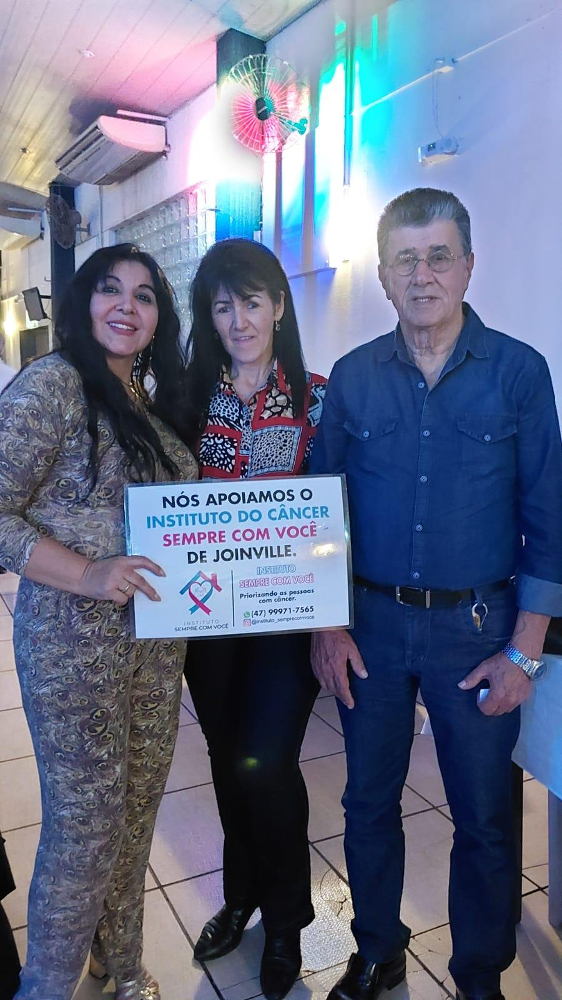

# Cecília: De Paciente a Voluntária — "Superamos Juntas!"

<!-- intro -->
Em maio de 2025, celebramos a chegada de uma nova voluntária ao Instituto Sempre Com Você: a Cecília — ex-paciente que, depois de superar o câncer, escolheu ficar e ajudar outras mulheres que estão no começo dessa jornada. Uma história de superação que se transforma em serviço!
<!-- /intro -->

"Superamos juntas!" — esse é o resumo perfeito dessa história linda. Cecília passou pelo tratamento acompanhada pelo Instituto, e a força que construiu nessa caminhada foi tão grande que ela não conseguiu simplesmente ir embora quando ficou bem. Ela ficou. Para ser o braço estendido que alguém um dia estendeu a ela.

A placa que Cecília segura orgulhosa diz tudo: "Nós apoiamos o Instituto do Câncer Sempre Com Você de Joinville." Esse apoio, vindo de quem viveu na pele a importância do Instituto, tem um peso e um significado inestimáveis.

Cecília, seja muito bem-vinda à nossa família de voluntárias! Você faz parte da nossa história — e agora vai ajudar a escrever a história de tantas outras mulheres que precisam de apoio.

Com imensa gratidão e alegria! 💕🌸

<!-- gallery -->
- 
<!-- /gallery -->

<!-- tags -->
- Cecília
- 2025
- voluntária
- ex-paciente
- superação
- gratidão
- engajamento
<!-- /tags -->
