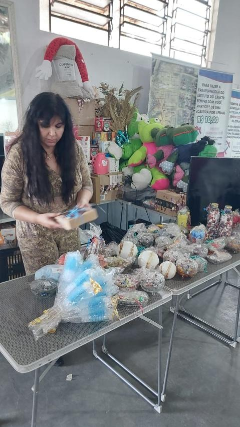
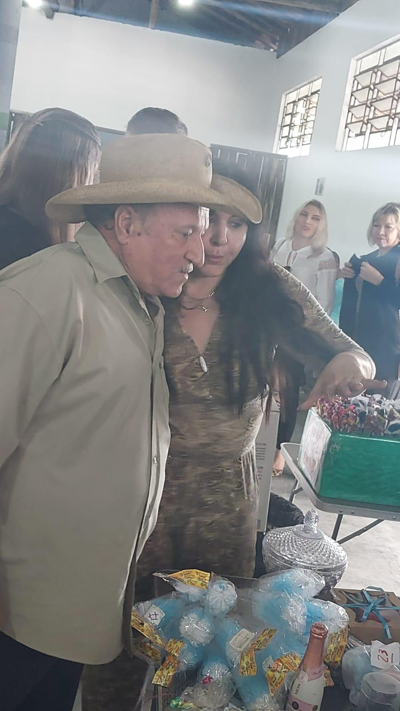
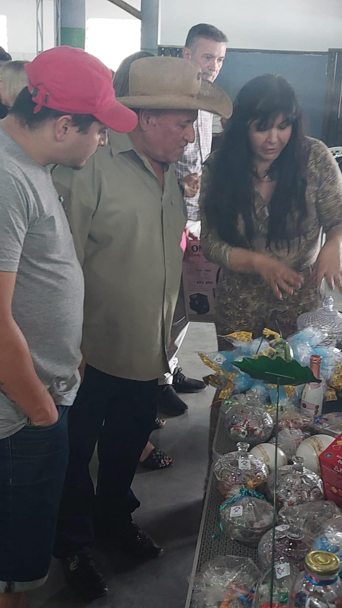
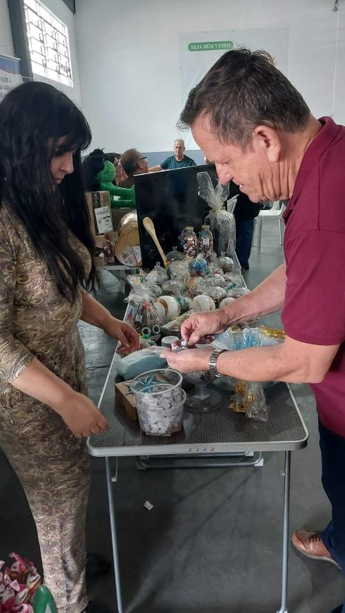
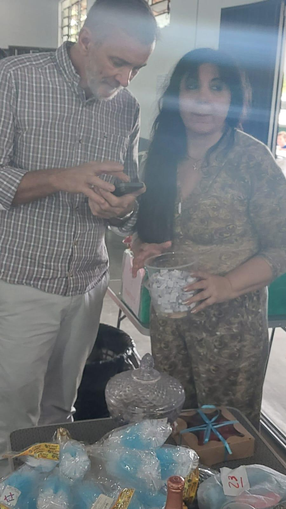

# Evento Beneficente de Junho: Amor em Forma de Festa!

<!-- intro -->
Junho de 2025 chegou com um evento beneficente que reuniu a nossa turma da terceira idade, familiares de pacientes e muitos corações generosos — e foi um sucesso lindo! Uma noite que prova, mais uma vez, que quando a comunidade se une em torno de uma causa, o resultado é sempre especial.
<!-- /intro -->

Preparar um evento beneficente é um trabalho que começa muito antes do dia — na organização dos produtos, na montagem das mesas, no cuidado com cada detalhe. E ver todo esse esforço se transformar em uma noite de alegria, solidariedade e arrecadação para os nossos pacientes é uma das maiores recompensas que podemos ter.

Nossa turma da terceira idade e os familiares dos pacientes foram, mais uma vez, a alma do evento — com disposição, energia e um amor incondicional pela causa. É impossível não se emocionar ao ver essa corrente do bem se manifestar tão concretamente.

Gratidão a cada pessoa que participou, ajudou na organização e contribuiu com a nossa missão. O amor que vocês demonstram aqui vai direto para o cuidado de quem mais precisa!

Obrigada, Joinville, por caminhar sempre com a gente. 💙🎉
